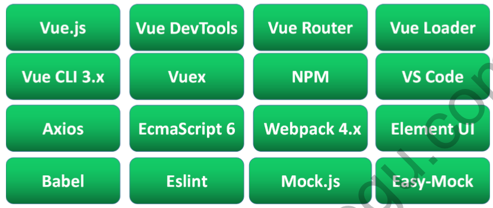
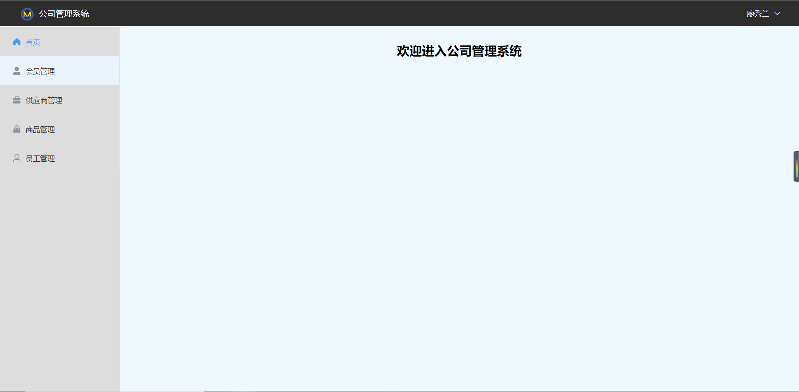
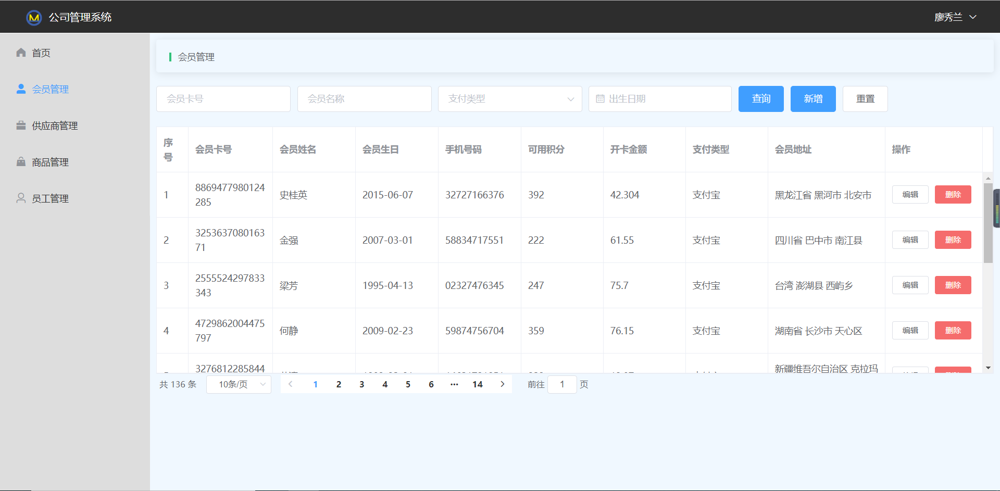
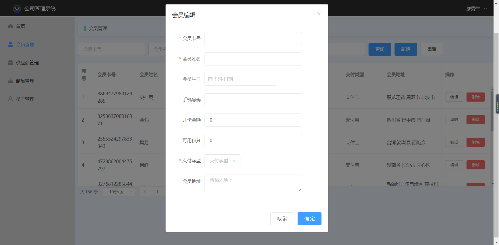
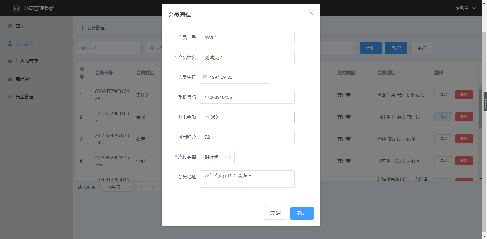
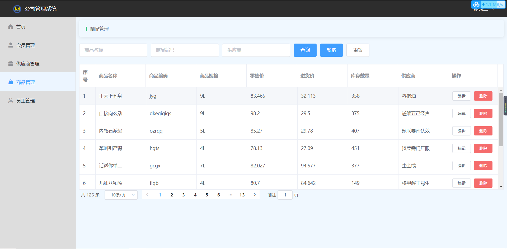

# msm(会员管理系统)技术栈

##项目需求
会员管理系统采用数据化管理会员、管理商品进销、供应商信息维护、员工管理等加快对店铺运营效率。
项目涉及功能模块：会员管理、供应商管理、商品管理、员工管理。
## 效果图(登录)
开发登录页面，当输入帐号和密码验证通过后，才允许进行到首页。效果图如下


##首页
登录成功后，后台验证成功才返回数据，并通过localStorage保存用户信息

##会员管理
会员管理主要针对充值会员进行管理，首先开发会员管理模块中的列表功能，包含条件查询、下拉框、日期功能、 数据列表、分页。 

####新增

####编辑

##供应商管理

##商品管理

##员工管理

## Project setup
```
yarn install
```

### Compiles and hot-reloads for development
```
yarn run serve
```

### Compiles and minifies for production
```
yarn run build
```

### Run your tests
```
yarn run test
```

### Lints and fixes files
```
yarn run lint
```

### Customize configuration
See [Configuration Reference](https://cli.vuejs.org/config/).
